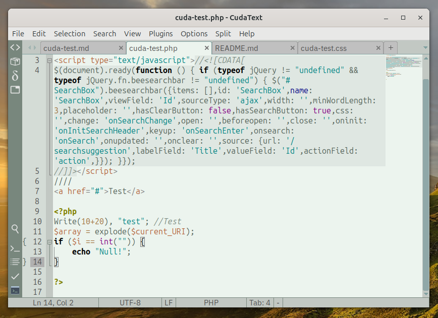

# Atelier Savanna theme

This is a theme for the [CudaText](https://github.com/Alexey-T/CudaText) editor.

It is based on the “[Atelier Savanna](https://github.com/tinted-theming/schemes/blob/spec-0.11/base16/atelier-savanna-light.yaml)” theme by [Bram de Haan](https://atelierbramdehaan.nl/); the palette can be conveniently viewed at the [original author’s website](https://atelierbram.github.io/syntax-highlighting/atelier-schemes/savanna/).

At present, only the “light” theme is available.

Values for the `syntax` theme could use more refinement; pull-requests are welcome.

## How to install a theme?
Download **ZIP** file, run the CudaText editor, drop this file on the main window and confirm installation. Select menu `Options -> Color themes -> UI -> THEME_NAME`.

## Changelog

* 2025.07.08
  - initial release
